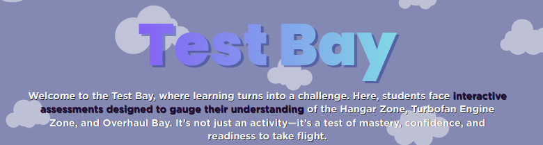
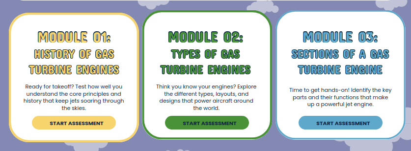
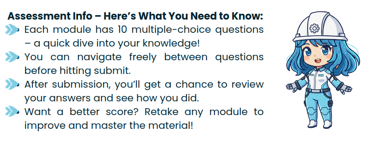

The following changes are supposed to happen on the test bay page:

1. The description text does not follow a consistent format and margin across tabs and lacks visual emphasis, making it harder to read against the background.

Change the color of the description to white.
Make the description text wider and aligned to a single, consistent margin used across all tabs (we prefer the wideness and margin of description in Test Bay Tab)
Make the description centered instead of justified
Change the font to Gotham Bold
Apply a black shadow to the description text to improve readability.
Change the color of specific highlighted text as indicated in the wireframe/reference/inspo (COLOR PURPLE or something that matches the gradient)

2. The current color of the module text box borders deviates from the previously approved layout.

Revert to the previous design, where each module has a different color while retaining the existing fonts.

3. The Test Bay title is a bit small and is not dynamic.

Resize the “Test Bay” title to make it slightly larger and more noticeable. 
Apply a dynamic styling similar to the gradient titles on the Homepage to maintain visual consistency and improve emphasis.
Apply a colored shadow that is closely related to its gradient color for emphasis.
Gradient Color Peg: Purple

4. The spacing between the JAJA icon and the Assessment Info section is too wide, making them appear disconnected and affecting visual cohesion.

Reduce the horizontal spacing between the JAJA icon and the Assessment Info so they appear more closely associated.

5. The text “Assessment Complete – Module 1: History…” is not easily readable due to poor color contrast.

Change the text color to improve contrast and ensure readability while still following the design theme. (copy from the test-bay title which is gradient purple) and add text shadow for the description text while keeping it white