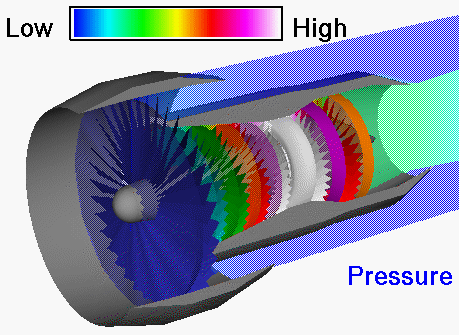
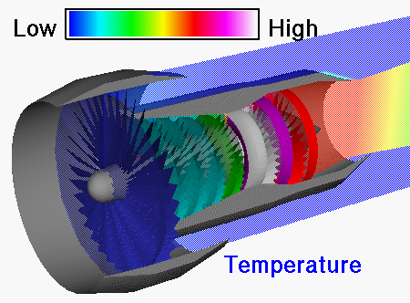
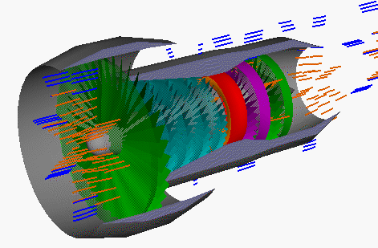

task: add the following content and images in turbofan engine / oveview and parameters
- A turbofan engine consists of a multi-bladed ducted propeller driven by a gas turbine engine.
- Turbofans were developed to provide a compromise between the best features of the turbojet and the turboprop.
- Turbofan engines have turbojet-type cruise speed capability yet retain some of the short-field takeoff capability of a turboprop.

images to add column-wise in one row:
- 
- 
- 